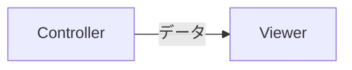

# Ebook-Separate コンテンツ形式 仕様書

## 1. 概要

`ebook-separate`は、単一のMarkdownファイルから、ページ分割された電子書籍形式のコンテンツを生成するためのフォーマットです。
この形式は、学習コンテンツやマニュアルなどを、利用者がページ単位で読み進められるように設計されています。

## 2. 基本仕様

- **ファイル形式:** UTF-8でエンコードされたプレーンテキストファイル
- **拡張子:** `.md`
- **基本構文:** GitHub Flavored Markdown (GFM) に準拠します。

## 3. ページ分割ルール

コンテンツは以下の2つのルールに基づいて自動的にページに分割されます。これらのルールは併用可能です。

### 3.1. 見出し1 (`#`) による分割

Markdownの「見出し1」（`#`）は、新しいページの開始点として扱われます。
`#`で始まる行が見つかると、その行の直前でページが区切られ、その行から新しいページが開始されます。

見出し1のテキストは、そのページのタイトルとしてビューアーに表示されます。

**例:**
```markdown
# 第1章 はじめに

この内容はすべて1ページ目に表示されます。

# 第2章 基本操作

この行から2ページ目が開始されます。
```

### 3.2. 水平線 (`---`) による分割

行頭から`---`のみが記述された行は、強制的な改ページ区切りとして扱われます。
この区切り文字の前後でページが分割されます。見出し1がないページを作成したい場合に便利です。

**例:**
```markdown
## 最初のページ

この内容は1ページ目に表示されます。

---

## 2ページ目

この内容は2ページ目に表示されます。
見出し1がなくてもページを分割できます。
```

## 4. サポートされるコンテンツ

ページ内では、標準的なGitHub Flavored Markdownの要素が利用できます。

- **見出し:** `#`, `##`, `###` など
- **テキスト:** 太字 (`**bold**`), イタリック (`*italic*`)
- **リスト:** 順序付き、順序なしリスト
- **引用:** `> quote`
- **テーブル**
- **タスクリスト:** `- [x] 完了タスク`
- **画像:** ``
- **コードブロック:**
  - 通常のコードブロック（シンタックスハイライト対応）
  ```javascript
  console.log("Hello, World!");
  ```
  - Mermaid.jsによる図表の描画
  ```mermaid
  graph TD
      A --> B;
      B --> C;
  ```

## 5. 実例

以下は、本仕様に基づいたコンテンツの記述例です。

```markdown
# 第1章 セットアップ

この章では、開発環境のセットアップ方法について説明します。

## 必要なツール

- Node.js
- Visual Studio Code

---

# 第2章 実装

いよいよ実装に入ります。

### 主要なコンポーネント

主要なコンポーネントは以下の通りです。

| コンポーネント名 | 役割 |
|---|---|
| Viewer | コンテンツを表示 |
| Controller | 状態を管理 |



このコンテンツは、合計2ページとして表示されます。
- 1ページ目: 「第1章 セットアップ」の内容
- 2ページ目: 「第2章 実装」の内容
```
