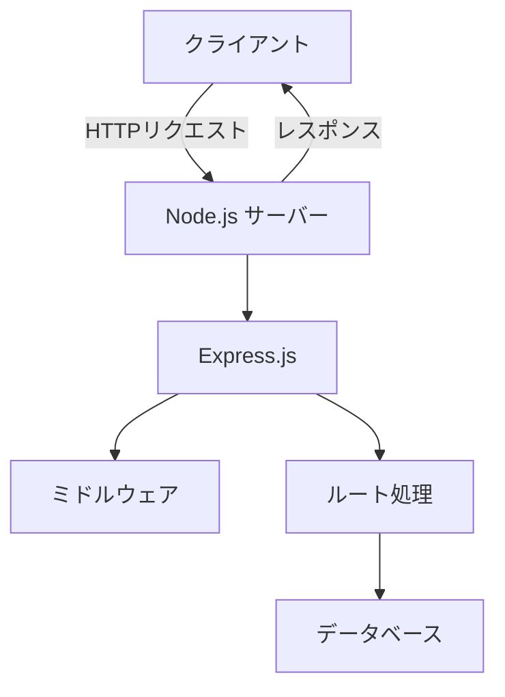

# Node.js 基礎ガイド

## はじめに

Node.jsはJavaScriptをサーバーサイドで実行するためのランタイム環境です。この電子書籍では、Node.jsの基礎から実用的な応用まで学習できます。

## 目次

1. [Node.jsとは](#nodejs-とは)
2. [環境構築](#環境構築)
3. [基本的な使い方](#基本的な使い方)
4. [モジュールシステム](#モジュールシステム)
5. [ファイルシステム](#ファイルシステム)
6. [HTTPサーバー](#http-サーバー)

---

## Node.js とは

Node.jsは、Chrome V8 JavaScriptエンジンをベースにしたJavaScriptランタイムです。

### 特徴

- **非同期I/O**: イベント駆動、ノンブロッキングI/O
- **高いパフォーマンス**: V8エンジンによる高速実行
- **豊富なパッケージ**: npmエコシステム
- **スケーラブル**: 大量の同時接続を効率的に処理

### 主な用途

1. **Webサーバー**: Express.jsなどのフレームワーク
2. **API開発**: RESTful API、GraphQL API
3. **リアルタイム通信**: WebSocket、Socket.io
4. **ツール開発**: CLI、ビルドツール

---

## 環境構築

### Node.jsのインストール

1. **公式サイトからダウンロード**
   - [https://nodejs.org](https://nodejs.org)から最新版をダウンロード
   - LTS版を選択することを推奨

2. **インストール確認**
   ```bash
   node --version
   npm --version
   ```

### 開発環境の準備

```bash
# プロジェクト初期化
npm init -y

# 必要なパッケージをインストール
npm install express
npm install --save-dev nodemon
```

---

## 基本的な使い方

### Hello World

最初のNode.jsプログラムを作成してみましょう。

```javascript
// hello.js
console.log('Hello, Node.js!');
```

実行方法：
```bash
node hello.js
```

### コマンドライン引数

```javascript
// args.js
const args = process.argv.slice(2);
console.log('引数:', args);
```

実行例：
```bash
node args.js hello world
# 出力: 引数: ['hello', 'world']
```

---

## モジュールシステム

Node.jsでは、コードをモジュールに分割して管理できます。

### 基本的なエクスポート/インポート

**math.js（モジュール）:**
```javascript
// 関数をエクスポート
function add(a, b) {
    return a + b;
}

function multiply(a, b) {
    return a * b;
}

module.exports = {
    add,
    multiply
};
```

**app.js（メイン）:**
```javascript
// モジュールをインポート
const math = require('./math');

console.log(math.add(5, 3));      // 8
console.log(math.multiply(4, 7)); // 28
```

### ES6モジュール形式

**package.json で有効化:**
```json
{
  "type": "module"
}
```

**ES6形式:**
```javascript
// math.mjs
export function add(a, b) {
    return a + b;
}

export function multiply(a, b) {
    return a * b;
}
```

```javascript
// app.mjs
import { add, multiply } from './math.mjs';

console.log(add(5, 3));
console.log(multiply(4, 7));
```

---

## ファイルシステム

Node.jsでファイル操作を行う方法を学習します。

### 同期的ファイル操作

```javascript
const fs = require('fs');

// ファイル読み込み
try {
    const data = fs.readFileSync('example.txt', 'utf8');
    console.log(data);
} catch (err) {
    console.error('エラー:', err);
}

// ファイル書き込み
try {
    fs.writeFileSync('output.txt', 'Hello, File System!');
    console.log('ファイルを作成しました');
} catch (err) {
    console.error('エラー:', err);
}
```

### 非同期的ファイル操作

```javascript
const fs = require('fs').promises;

async function fileOperations() {
    try {
        // ファイル読み込み
        const data = await fs.readFile('example.txt', 'utf8');
        console.log(data);
        
        // ファイル書き込み
        await fs.writeFile('output.txt', 'Hello, Async File System!');
        console.log('ファイルを作成しました');
    } catch (err) {
        console.error('エラー:', err);
    }
}

fileOperations();
```

---

## HTTP サーバー

Node.jsでWebサーバーを作成する方法を学習します。

### システム構成図



### 基本的なHTTPサーバー

```javascript
const http = require('http');

const server = http.createServer((req, res) => {
    res.writeHead(200, { 'Content-Type': 'text/html; charset=utf-8' });
    res.end('<h1>Hello, Node.js Server!</h1>');
});

const PORT = 3000;
server.listen(PORT, () => {
    console.log(`サーバーが http://localhost:${PORT} で起動しました`);
});
```

### Express.jsを使用したサーバー

```javascript
const express = require('express');
const app = express();

// ミドルウェア
app.use(express.json());

// ルート定義
app.get('/', (req, res) => {
    res.json({ message: 'Hello, Express!' });
});

app.get('/users/:id', (req, res) => {
    const userId = req.params.id;
    res.json({ userId, name: `ユーザー${userId}` });
});

app.post('/api/data', (req, res) => {
    console.log(req.body);
    res.json({ success: true, received: req.body });
});

const PORT = 3000;
app.listen(PORT, () => {
    console.log(`Express サーバーが http://localhost:${PORT} で起動しました`);
});
```

---

## 新機能のテスト

### 絵文字のサポート

Node.jsの学習、楽しいですね！ :rocket: :heart_eyes: :computer:

開発が完了したら :white_check_mark: をつけましょう :thumbsup:

### チェックボックス

学習進捗をチェックしてみましょう：

- [x] Node.jsの概要を理解
- [x] 環境構築が完了
- [ ] 基本的なAPIを覚える
- [ ] Express.jsの学習
- [ ] データベース連携
- [x] HTTPサーバーの作成

---

## まとめ

この電子書籍では、Node.jsの基礎を学習しました。

### 学習した内容

✅ Node.jsの概要と特徴  
✅ 環境構築  
✅ 基本的な構文  
✅ モジュールシステム  
✅ ファイルシステム操作  
✅ HTTPサーバー構築  

### 次のステップ

1. **フレームワークの学習**: Express.js、Koa.js
2. **データベース連携**: MongoDB、PostgreSQL
3. **認証システム**: JWT、Passport.js
4. **デプロイ**: Heroku、AWS、Vercel

---

## 参考資料

- [Node.js 公式ドキュメント](https://nodejs.org/docs/)
- [npm 公式サイト](https://www.npmjs.com/)
- [Express.js ガイド](https://expressjs.com/)

---

*📖 この電子書籍はマークダウンで作成され、スキルチェッカーライブラリで表示されています。*