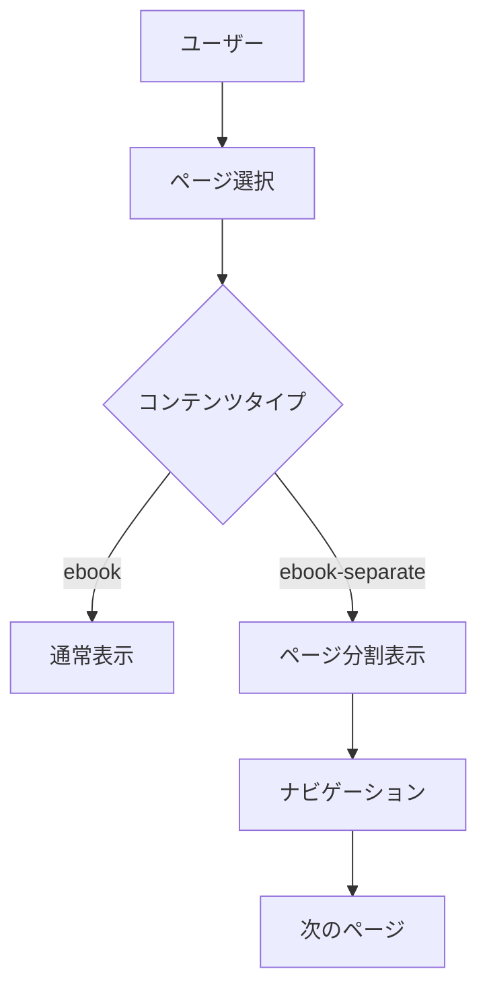

# 第1章 はじめに

これはページ分割表示のテスト用サンプルコンテンツです。
見出し1（#）で自動的にページが分割されます。

## 基本概念

このシステムでは以下の規則でページが分割されます：

- 見出し1（`#`）で必ず新しいページが開始される
- `---` が見つかった場合もそこでページが分割される
- ナビゲーションボタンでページ間を移動できる

## 機能一覧

### 基本機能
- 前へ/次へボタン
- ページジャンプ機能
- 現在のページ数表示

### 追加機能
- ライブラリに戻る機能
- GitHubリンク（設定されている場合）

---

# 第2章 使用方法

ここから第2章が始まります。上の `---` によってページが分割されました。

## ナビゲーション

ページの上下にナビゲーションバーが配置されています：

1. **前へボタン** - 前のページに移動
2. **次へボタン** - 次のページに移動
3. **ページジャンプ** - 直接指定したページに移動

## コンテンツ表示

マークダウンの様々な要素が正しく表示されることを確認します：

### コードブロック

```javascript
function testFunction() {
  console.log('Hello, World!');
  return 'テスト成功';
}
```

### リスト表示

- 項目1
- 項目2
  - サブ項目1
  - サブ項目2
- 項目3

### 表

| 機能 | 説明 | 状態 |
|------|------|------|
| ページ分割 | 見出し1で分割 | ✅ |
| --- 分割 | ---で分割 | ✅ |
| ナビゲーション | 前後移動 | ✅ |

# 第3章 高度な機能

見出し1によって、また新しいページが開始されました。

## Mermaid図



## チェックボックス

- [x] 基本実装完了
- [x] ナビゲーション実装
- [x] ページジャンプ機能
- [ ] 今後の拡張予定

## 引用

> これはページ分割機能のテストです。
> 複数行にわたる引用も
> 正しく表示されるはずです。

---

このセクションは `---` で分割された独立したページです。

## 画像表示テスト


*画像が設定されている場合の表示例*

## 数式（GitHub表示推奨）

数式は以下のように記述できます：

```
E = mc²
```

GitHubでの表示が推奨されます。

# 第4章 まとめ

最後の章です。

## 実装された機能

✅ **完了した機能：**
- ページ自動分割（見出し1基準）
- 手動分割（--- 基準）
- ナビゲーションUI
- ページジャンプ
- 現在位置表示

## 今後の改善点

🔄 **改善予定：**
- ページ履歴機能
- ブックマーク機能  
- 目次表示
- 検索機能

## 最終確認

すべての機能が正常に動作することを確認してください：

1. 前のページに戻れるか
2. 次のページに進めるか
3. ページジャンプが動作するか
4. ライブラリに戻れるか

**テスト完了！** 🎉

このコンテンツでページ分割機能の動作確認ができます。