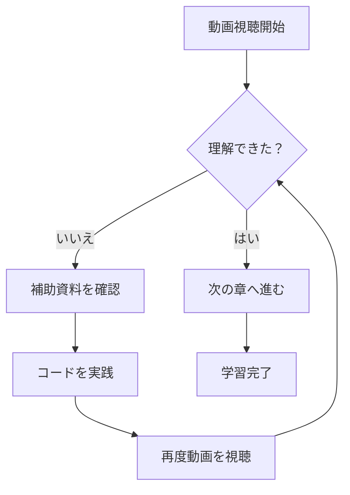

# 動画学習ガイド

この補助資料では、動画の内容をより深く理解するための追加情報を提供します。

## 📋 学習の進め方

### 1. 事前準備
動画を視聴する前に、以下の点を確認してください：

- 基本的なプログラミング知識
- 開発環境の準備
- 必要なツールやライブラリ

### 2. 動画視聴のポイント
動画を効果的に学習するためのコツ：

- **一時停止を活用**: 重要な部分で動画を止めて理解を深める
- **繰り返し視聴**: 難しい概念は何度も見直す
- **実際に手を動かす**: 説明されたコードを実際に書いてみる

## 🔧 技術的な補足情報

### 重要な概念

```javascript
// サンプルコード例
function exampleFunction() {
    console.log("動画で説明される重要なコンセプト");
    return "理解度チェック";
}
```

### 実装のポイント
1. **エラーハンドリング**: 適切な例外処理を実装する
2. **パフォーマンス**: 効率的なアルゴリズムを選択する
3. **保守性**: 読みやすく維持しやすいコードを書く

## 📊 図解による理解



## 🎯 学習目標

この動画と補助資料を通じて、以下のスキルを身につけることができます：

- [ ] 基本概念の理解
- [ ] 実装手法の習得
- [ ] ベストプラクティスの適用
- [ ] トラブルシューティング能力

## 💡 さらなる学習リソース

### 参考文献
- 公式ドキュメント
- 関連書籍
- オンラインチュートリアル

### 実践課題
1. **基礎課題**: 動画の内容を復習する練習問題
2. **応用課題**: 学んだ知識を活用したプロジェクト
3. **発展課題**: より高度な実装への挑戦

## ❓ よくある質問

### Q: 動画の内容が理解できない場合はどうすれば？
A: まずはこの補助資料を参照し、基本概念を復習してください。それでも理解が困難な場合は、前の章に戻って基礎を固めることをお勧めします。

### Q: 実装で躓いた場合の対処法は？
A: エラーメッセージを確認し、動画の該当部分を再視聴してください。また、サンプルコードとの差異をチェックしましょう。

### Q: 学習の進度が遅い場合は？
A: 個人のペースで学習することが重要です。理解を優先し、焦らず着実に進めてください。

## 🚀 次のステップ

この動画の学習が完了したら：

1. **復習**: 重要なポイントをもう一度確認
2. **実践**: 学んだ内容を自分のプロジェクトで活用
3. **発展**: 関連する高度なトピックに挑戦

---

*この補助資料は動画コンテンツと合わせて学習効果を最大化するために作成されました。*